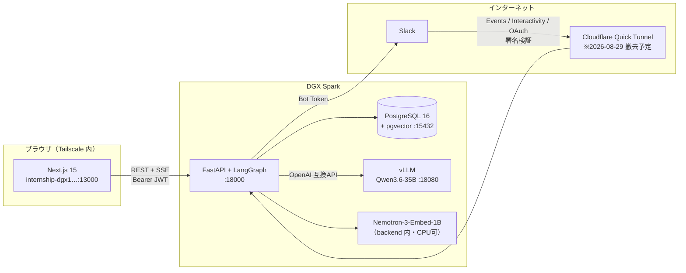
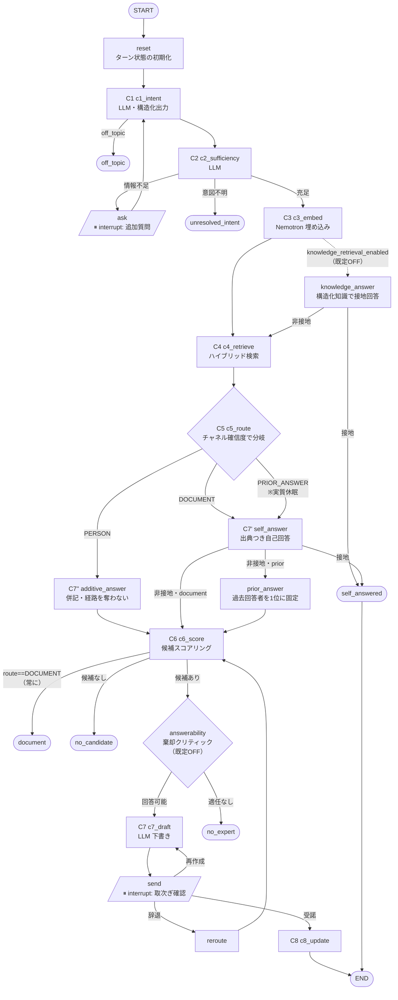
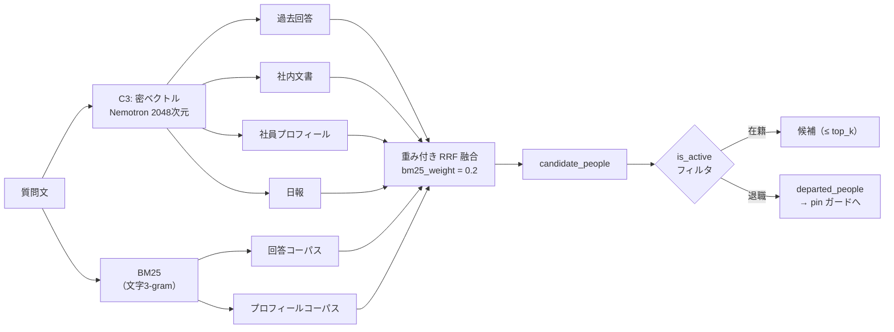
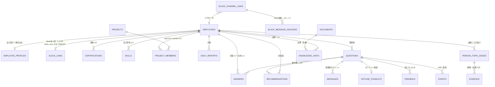
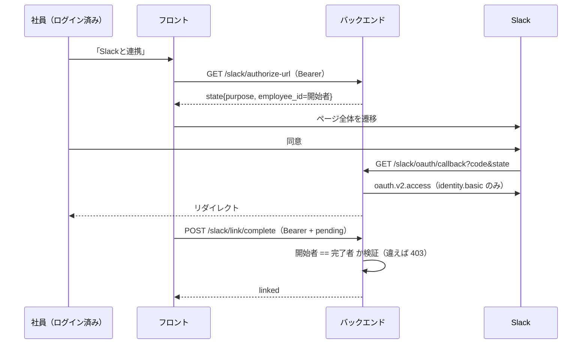
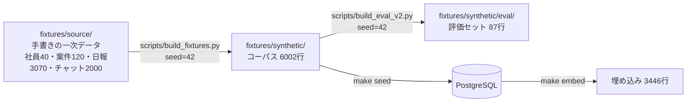

# TEKIJIN システム仕様書（2026-08-27 時点の実装）

> **この文書の位置づけ**
>
> 既存の `docs/specs/` 配下の仕様書は、実装が先に進んだ結果として複数の箇所が実態と食い違っている
> （§18 に一覧）。この文書は **2026-08-27 時点の develop（`674f949`）を読んで書き起こした、実装の記述**である。
> 「こうしたい」ではなく「**こうなっている**」を書く。
>
> **確認方法**: 各記述はコードの該当箇所を読んで確認した。数値は実際に数え直した。
> 本番環境の挙動は DGX（`internship-dgx1.tail349bcd.ts.net`）に対して実測した。
> 確認できなかったものは「未確認」と明記する。推測は書かない。

---

## 1. プロダクトの目的

**社内の暗黙知を、使うほど形式知として貯める。**

質問を受けたら、まず貯まった知識で答えられるかを試し、答えられなければ**人に取り次ぐ**。
取り次ぎの結果として生まれた回答は、次の質問のための知識として貯まる。

「AIが何でも答える」ものではない。**根拠を1つも示せないなら答えない**（`grounded=false` で取次ぎへ退避）。
誰が答えたかが必ず残る点で、QAボットとは別物として設計されている。

---

## 2. 技術スタック

### 2.1 バックエンド（`backend/requirements.txt`・すべてピン留め）

| 領域 | 採用 | バージョン |
|---|---|---|
| Web フレームワーク | FastAPI | `0.115.6` |
| ASGI サーバ | uvicorn[standard] | `0.34.0` |
| エージェント基盤 | LangGraph | `0.3.34` |
| LLM 抽象 | langchain / langchain-core / langchain-openai | `0.3.27` / `0.3.86` / `0.2.14` |
| チェックポインタ | langgraph-checkpoint / -postgres | `2.1.2` / `2.0.21` |
| ORM | SQLAlchemy | `>=2.0,<2.1` |
| DB ドライバ | psycopg[binary] / psycopg-pool | `>=3.2,<4` / `3.3.1` |
| ベクトル | pgvector | `>=0.3,<0.4` |
| スキーマ | pydantic / pydantic-settings | `2.10.4` / `2.7.1` |
| 認証 | PyJWT | `2.10.1` |
| HTTP クライアント | httpx | `0.28.1` |
| 疎検索 | rank-bm25 | `>=0.2,<0.3` |
| 日本語形態素解析 | SudachiPy（分割モード C） | `>=0.6,<0.7` |
| SSE | sse-starlette | `2.2.1` |
| 埋め込み実行 | sentence-transformers / torch | `>=5.4` / `>=2.2`（`requirements-ml.txt`・CI には入れない） |

**LangGraph / LangChain を固定している理由**: この層は破壊的変更が多く、`interrupt`/`resume` の意味論が
バージョン間で変わると人間の介入点（§5）が壊れる。CI を緑に保つより、**挙動を固定する**ことを優先している。

**`sentence-transformers` / `torch` を `requirements.txt` に入れていない理由**:
CI に GPU も重いホイールも持ち込まないため。LLM ノードは CI では決定的スタブに差し替わる。

### 2.2 フロントエンド（`frontend/package.json`）

| 領域 | 採用 | バージョン |
|---|---|---|
| フレームワーク | Next.js（App Router） | `^15.0.0` |
| UI | React | `^19.0.0` |
| スタイル | Tailwind CSS | `^3.4.0` |
| 言語 | TypeScript | `^5.6.0` |
| 単体/結合テスト | Vitest + Testing Library | `^2.1.0` / `^16.0.0` |
| E2E | Playwright | `^1.48.0` |
| Lint / Format | Biome | `1.9.4` |
| アニメーション | anime.js | `^4.5.0` |

**既製のチャットUI（chatbot-ui 等）をフォークしていない**（ADR-0011）。必要なチャット/カード
コンポーネントだけを自前で設計している。理由は、この製品の主画面が「チャット」ではなく
**推薦カードと取次ぎ**であり、チャットUIを土台にすると不要な依存（Supabase 等）と
不要な画面構造を抱え込むため。

### 2.3 インフラ

| 領域 | 採用 |
|---|---|
| DB | PostgreSQL 16 + pgvector（`pgvector/pgvector:0.8.6-pg16`） |
| LLM サービング | vLLM（Docker）。**コードの既定は `stub`**、本番は `.env` で `vllm` |
| 実行環境 | DGX Spark（Tailscale 内のみ） |
| デプロイ | GitHub Actions self-hosted runner → `deploy/deploy.sh` |
| ワーカー数 | **1固定**（セッションのディスパッチ登録がプロセス内にあるため。全起動経路をテストで固定） |
| CI | GitHub Actions（format / lint / test / e2e / pr-policy / deploy） |

---

## 3. アーキテクチャ全体



**フロントとバックエンドは同一ホストの別ポート**で、ブラウザからは両方に直接届く（Tailscale 内のみ）。
API のベースURLは**ビルド時に焼き込まれる**（`NEXT_PUBLIC_API_BASE_URL`）ため、
実行時の環境変数では変更できない。

---

## 4. エージェントグラフ（C1〜C8）

`backend/src/tekijin/agent/graph.py` が LangGraph の `StateGraph` を組み立てる。
**ノードは常時17本＋フラグで最大6本**（`answerability`/`no_expert`/`self_answer`/`self_answered`/
`knowledge_answer`/`additive_answer`）。



### 4.1 人間の介入点は2箇所だけ

LangGraph の `interrupt()` は **`ask`（`nodes.py:347`）と `send`（`nodes.py:684`）にしか無い**。

- **`ask`** — 情報が足りないとき、追加質問を返して**人間の回答を待つ**。回答は `c1_intent` に戻り、
  質問を作り直す（＝理解し直す）
- **`send`** — 下書きと取次ぎ先を提示して**人間の判断を待つ**。受諾・辞退・再作成の3方向

この2点以外は自動で流れる。**「AIが勝手に人に送る」ことはない。**

### 4.2 `route == DOCUMENT` は必ず document 終端

`_after_c6`（`graph.py:58-65`）は、**推薦が出ていても** `route == DOCUMENT` なら `document` 終端に行く。
文書で自己解決できる質問を、人の手間に変換しないための設計（#279）。
その際も C6 は走らせて、文書の裏にいる専門家を「fallback候補」として提示する。

---

## 5. 検索（C4）

`backend/src/tekijin/retrieval/retriever.py`。

### 5.1 チャネルと融合



融合のパラメータ: `rrf_k = 60`、`top_k = 10`、各チャネルは融合前に `max(top_k*5, 50)` 件まで取る。
密検索は **pgvector の総当たりコサイン走査**で、**ANN インデックスは張っていない**
（数千行の規模では不要なため。`halfvec` ではなく `vector` 型なのも同じ理由）。

**BM25 の重みを 0.2 に下げている理由**（ADR-0003）: 評価セットの質問が「症状で書く」設計のため、
語彙一致が効きにくく、等倍で混ぜると密検索の順位を壊す。実測で **−0.128** だったため下げた。
`0.0` にすると BM25 は完全に無効化される。

### 5.2 退職者の除外（#506）

候補は `_aggregate_people` の結果を **`active_employee_ids()` で絞ってから**返す
（`retriever.py`）。回答本体はコーパスに残す — **回答に含まれる知識は在籍と無関係に生き続ける**が、
「聞く相手」としては出さない。取り次ぎを届ける Slack link が、退職処理で外れているため。

除外された回答者は `departed_people` として返され、`prior_answer` の pin ガードが使う（§6.2）。

---

## 6. ルーティング（C5）

`backend/src/tekijin/agent/route.py`。**決定的**（3つの絶対類似度と候補の有無だけで決まる）。

| 定数 | 値 |
|---|---|
| `PRIOR_ANSWER_SIM` | `0.55` |
| `DOCUMENT_SIM` | `0.28` |
| `PERSON_WEAK_SIM` | `0.40` |

判定順:

1. `prior_answer_reuse_min` が設定されていれば corpus-count ルーティング（**既定 `None` = OFF**）
2. `answer_conf >= 0.55` かつ過去回答あり → **PRIOR_ANSWER**
3. `document_conf >= 0.28` かつ `people_conf < 0.40` かつ `answer_conf < 0.55` → **DOCUMENT**
4. それ以外 → **PERSON**（既定の着地点）

### 6.1 ⚠️ `prior_answer` 経路は実質休眠している

**`PRIOR_ANSWER_SIM = 0.55` は、観測された `answer_confidence` の最大値 0.542 の直上に
意図的に置かれている。** つまり**この経路は発火しない**。

理由（ADR-0007 / #119 / #327）: Nemotron のコサインでは prior_answer を分離できない
（person gold の方が prior_answer gold より高く出る）。`reuse_count` による代替ルーティングも
掃引したが、**どの設定も Pareto 改善しなかった**（person recall が 1.000 → 0.224〜0.816 に壊れる）。

実測の経路 recall: **person 49/49 ・ document 11/16 ・ prior_answer 0/7**。

**既存の `product-spec.md` はこの経路を前提に §3⑧・§5・§6・KPI（自己解決率）を組み立てているが、
現在の設定では到達しない。**

### 6.2 pin ガード

`prior_answer` ノードは過去の回答者を**順位1位に固定**する。この pin は**候補プールの外に手を伸ばす**
のが目的（順位に入らなくても過去の回答者に取り次ぐ）ため、プール非所属を理由に止めてはいけない。
そこで **`departed_people`（退職者）に含まれる場合だけ** pin を取り消す。

---

## 7. スコアリング（C6）

`backend/src/tekijin/scorer/`。

### 7.1 重み（`weights.py`）

```
score = 0.45·topic_fit + 0.20·answer_quality + 0.15·recency + 0.10·proximity
        − 0.20·load + 1.0·question_fit
```

**`question_fit`（#405）は既定ON**（`question_fit_enabled=True`）。
質問文と、その人の過去回答との最大コサイン（qsim）を加算する。

**なぜ足したか**: `topic_fit` は**トピックのタグしか見ず、証拠2〜3件で飽和する**（ADR-0006）。
そのため「質問そのもの」で順位を変えられず、**C1 がトピックを外すと gold の専門家を落とす**。
qsim は（間違っているかもしれない）トピックラベルに関係なく、質問に実際に合う回答を持つ人を持ち上げる。
実測で全体 Hit@3 0.742→0.788、**C1 が外した行に限れば 0.444→0.778**。

⚠️ `question_fit` の係数 1.0 は**経験的な値であって理論的な上限ではない**。qsim の理論最大は 1.0 で
`topic_fit` の上限 0.45 を超えるため、**埋め込みモデルを差し替えたら再較正が要る**。

### 7.2 証拠の base score

| 証拠 | 重み |
|---|---|
| 有用だった回答（`was_helpful`） | 1.0 |
| プロジェクトリード | 0.8 |
| 過去の回答 | 0.7 |
| 資格 | 0.6 |
| プロジェクト参加 | 0.5 |
| 自己申告スキル | 0.3 |
| 日報（既定OFF: `daily_evidence_enabled=False`） | 0.15（上限5件） |

**辞退は負の証拠ではない。** 可用性（load）を下げるだけで、スキル評価は下げない。

---

## 8. AIモデル設計

### 8.1 LLM

| 項目 | 値 |
|---|---|
| モデル | `Qwen3.6-35B-A3B-NVFP4`（`config.py:52`） |
| サービング | vLLM（OpenAI 互換API） |
| バックエンド選択肢 | `stub` / `vllm` の2つのみ（`llm/factory.py`） |
| C1/C2 温度 | `0.0`（構造化出力） |
| C7 温度 | `0.5`（下書き） |
| thinking | `chat_template_kwargs.enable_thinking` で制御（#141） |

**本番で実際に動いている vLLM の引数（実測）**:
`--reasoning-parser qwen3 --tool-call-parser hermes --enable-auto-tool-choice --quantization modelopt`

> ⚠️ **リポジトリ内で記述が食い違っている。** `scripts/serve_vllm.sh` の冒頭コメントは
> `--tool-call-parser qwen3_xml` と書いているが、`docs/gpu-server-setup.md` と `.env.example` は
> `hermes` と書き、**本番は `hermes` で正常に動作している**（2026-08-27 に `docker inspect` で実測）。
> どちらが正しいかは未検証。**動いている構成は `hermes`** である。

**`--enable-auto-tool-choice` と `--tool-call-parser` は両方必須**。片方だけだと vLLM はパーサを
組まず 400 を返し、C1 の構造化出力が**全件空になる**（エラーではなく静かに劣化する）。

**Claude API / Anthropic へのフォールバックは実装されていない。**
`anthropic` はコードにも依存にも一切存在しない（`technical-spec.md` と `model-definition.md` の
記載は誤り）。**プロンプト用のディレクトリも存在しない** — プロンプトは `llm/vllm.py` に直書き。

### 8.2 埋め込み

| 項目 | 値 |
|---|---|
| モデル | `nvidia/Nemotron-3-Embed-1B-BF16` |
| 次元 | `2048` |
| E5 プレフィックス | 有効（`query:` / `passage:`） |
| 実行 | backend プロセス内（`CUDA_VISIBLE_DEVICES=""` で CPU に寄せられる） |

**選定理由**（ADR-0002）: 日本語の社内文書・プロフィールに対する R@3 で他候補を上回った（0.615）。
GPU は vLLM が占有するため、埋め込みは CPU に逃がせることも条件だった。

**次元を変えると既存ベクトルは NULL にリセットされる**（`apply_migrations` が `USING NULL` で
列を張り替える）。`make embed` で全件再計算が必要。

---

## 9. データモデル

`backend/src/tekijin/models/tables.py` に **24テーブル**。



### 9.1 設計上の要点

- **`employees.is_active`（#506）** — 退職しても**行は消さない**。質問・回答・証拠が参照しているため。
  候補プールから外すだけ。既定 `true`（列にもDDLにも）
- **`employees.password_hash`** — PBKDF2。`NULL` は**絶対に検証を通らない**ので、
  Slack 経由で作られた社員はパスワードログインできない
- **`slack_links.slack_user_id` は UNIQUE** — 1つの Slack アカウントは1人の社員にしか紐づかない
- **`knowledge_units` は `(source_type, source_id)` が UNIQUE** — 抽出バッチを何度流しても冪等
- **`documents` の 36件中6件が型番付き**（`doc_031`〜`doc_036`・`product_model`）

---

## 10. API

**約40エンドポイント**。認証の区分は3つ。

| 区分 | 依存性 | 例 |
|---|---|---|
| 無認証 | なし（署名検証あり） | `POST /slack/events`, `POST /slack/interactivity`, `GET /slack/oauth/callback`, `GET /health` |
| ログイン必須 | `require_principal` | `POST /ask`, `GET /inbox`, `GET /questions`, `GET /knowledge`, `POST /handoff/*` |
| 管理者のみ | `require_admin` | `GET /dashboard`, `GET /employees`, `POST /slack/sync-users` |

SSE は `GET /events/{session_id}`。**ブラウザの `EventSource` は Authorization ヘッダを送れない**ため、
このルートだけ `?token=` を受け付ける（他のルートでは受け付けない — トークンをアクセスログに
残さないため）。

> **`/docs`・`/redoc`・`/openapi.json` は既定で 404。** `expose_api_docs` が `False`。
> `/openapi.json` は全エンドポイントのパス・型を返すため、公開経路がある状態では塞ぐ。

---

## 11. 認証

| 項目 | 値 |
|---|---|
| 方式 | Bearer JWT（HS256） |
| TTL | 12 時間 |
| パスワード | PBKDF2-SHA256 / 600,000 反復 / 16バイトソルト |
| 管理者 | **社員行を持たない**（`employee_id = None` の非社員プリンシパル） |
| ブルートフォース | `login_max_attempts` で制限 |

**起動時ガード**（`app.py`）: `app_env != "development"` のとき、`auth_secret` や `admin_password` が
既定値のままなら**起動を拒否する**。

⚠️ **既知の穴**: `demo_user_password` はこのガードの対象外で、`make seed` は**全40名に同じハッシュ**を
入れる。全社員が同じパスワードのままデプロイできてしまう。

### 11.1 同じ鍵で4種類のトークンを署名している

`auth_secret` は、アクセストークン・OAuth link state・OAuth login state・pending link token の
**4つすべてを署名する**。区別は JWT の `purpose` クレームだけ。
そのため **`purpose` の検証は全消費経路で必須**であり、実際に全経路で検証している。

---

## 12. Slack 連携

### 12.1 連携（link）— Cookie を使わない



**開始者と完了者の一致を要求する理由**: このフローは**同じ脆弱性クラスを4回**踏んでいる。
本質は「**2つの半分が別人のもの**」。

| 周 | 何が起きたか |
|---|---|
| 1 | state に攻撃者の `employee_id` → **被害者の Slack が攻撃者の行へ** |
| 2 | pending 方式にしたら逆向きが空いた → **攻撃者の Slack が被害者の行へ** |
| 3 | 開始者==完了者を要求して閉塞（#494） |
| 4 | ディレクトリ同期で再発。規則が全て「同期前のDBスナップショット」しか見ておらず、**同じ `users.list` の中での衝突**が素通り |

### 12.2 ログイン（login）— Cookie を着地ホストで発行

`POST /slack/login-url` → **`<公開オリジン>/slack/oauth/start`** を返す。
`/slack/oauth/start` が nonce Cookie（`HttpOnly; Secure; SameSite=Lax; Path=/slack; Max-Age=600`）を
発行してから Slack へ 302 する。

**なぜこの形か**: フロントのバンドルは `…:18000` を叩き、Slack は**トンネルのホスト**に着地する。
**Cookie はホスト単位なので届かない**。さらに `redirect_uri` が https なので `Secure` が付き、
平文HTTP応答では保存すらされない。**テストは全緑で本番は全滅**だった。
そこで Cookie を「コールバックと同じオリジン」で発行する形に変えた。

`SameSite=Lax` が必要十分であることは実ブラウザ（Chromium）で確認済み
（`Lax` → Cookie 到達 / `Strict` → 到達せず）。

### 12.3 取り次ぎ（ペアチャンネル）

**質問者と回答者の両方が連携済みでないと成立しない**（`notify.py`）。
片方でも未連携なら**チャンネルを作らない**。ボットDMへのフォールバックは**意図的に作っていない**
（2つの画面に分かれて分かりにくいため棄却）。

### 12.4 必要な Bot スコープ（本番で実測）

```
groups:write, chat:write, groups:history, im:write
```

`users.list` 同期を有効にするには **`users:read` と `users:read.email` の追加が必要**（現在は無い）。
`reaction_added` を使うには **`reactions:read`** が必要（どのドキュメントにも書かれていない）。

### 12.5 ディレクトリ同期（既定OFF）

`POST /slack/sync-users`（管理者のみ）。**アプリ内タイマーではなくエンドポイント＋cron**。
デーモンスレッドが例外を飲み込んで気づかれなかった実績があるため、
「誰がログインできるか」を決める表を書く処理は**失敗の行き先がある場所**に置いている。

規則（人間の同意が1つも介在しないため、構造として持たせている）:

- 既存の link は上書きしない
- 他人に紐づく Slack アカウントを付け替えない
- `deleted: true` のときだけ外す（**一覧からの不在では外さない**）
- 外す対象は Slack ID で引く（メールで引くと別人の行を切る）
- メールが無ければ対象外（表示名の曖昧一致を認証経路に入れない）
- 管理者アドレスは連携しない
- **同じ回の中で2人が同じ社員/アドレスを主張したら、どちらも処理しない**

⚠️ **塞げていないリスク**: 未入社者のアドレスの先取り。攻撃者が入社予定者のアドレスを
自分のプロフィールに入れると、社員行が作られて攻撃者に紐づき、**本人は永久に弾かれる**（復旧は手作業）。
`slack_user_sync_allowed_domains` で社外ドメインは止まるが、**ドメイン内の先取りは止まらない**。
**前提条件は「Slack のメールが検証済み（SSO/SCIM 運用）であること」。**

---

## 13. 知識層

`knowledge_units` に「問題 → 打ち手 → 結果」の構造化ケースを貯める。

- **生成**: オフラインの LLM バッチのみ（`scripts/extract_knowledge.py` = 日報、
  `extract_chat_knowledge.py` = チャット）。**グラフからは呼ばれない**
- **消費**: `knowledge_answer` ノード（既定OFF）と、出典表示
- **レビュー用の HTTP エンドポイントは無い**。`set_review_status` の呼び出し元は
  Slack の「残さない」だけ

### 13.1 「接地（grounded）」は2つの意味を持つ

| どこ | 意味 |
|---|---|
| `knowledge_answer` | **構造的**。承認済みユニットがコサイン下限を超え、本文はDBの値から組み立てる。**LLM を通さないので幻覚が起きない** |
| `self_answer`（#291） | LLM の**自己申告**（`grounded=true` ＋ 引用1件以上）。ただし**再検証する** — 引用IDが全部でっち上げなら `grounded=False` に格下げして取次ぎに戻す |

### 13.2 生チャットをそのまま知識源にしても効かない（実測）

grounded 率: baseline **0.265** / +日報 **0.347** / **+チャット 0.286** / +両方 **0.286**。
挨拶・連絡・雑談が大半のため。LLM で「問題→打ち手→結果」に構造化して初めて価値が出る。

---

## 14. フィーチャーフラグ

| フラグ | 既定 | 意味 |
|---|---|---|
| `self_answer_enabled` | **True** | データ由来経路で出典つき自己回答を試す |
| `additive_self_answer_enabled` | **True** | person 経路で自己回答を**併記**（経路は奪わない） |
| `additive_self_answer_floor` | `0.20` | 併記の下限 |
| `question_fit_enabled` | **True** | C6 に qsim 項を加える（#405） |
| `daily_knowledge_enabled` | **True** | 日報を検索チャネルに含める |
| `similar_askers_enabled` | **True** | 「N人が同じ分野で質問」の安心表示 |
| `knowledge_retrieval_enabled` | False | `knowledge_answer` ノードを配線する |
| `score_all_employees` | False | C6 の候補を全社員にする（**測定のうえ棄却**・ADR-0009） |
| `answerability_enabled` | False | 棄却クリティック |
| `branch_constraint_enabled` | False | 拠点制約（**測定が汚染**・ADR-0010） |
| `prior_answer_reuse_min` | None | corpus-count ルーティング（**棄却**・ADR-0007） |
| `query_expansion_enabled` | False | クエリ拡張（**E2E で person recall を壊す**） |
| `daily_evidence_enabled` | False | 日報を証拠として加点 |
| `slack_login_enabled` | False（**本番 True**） | Slack でログイン |
| `slack_user_sync_enabled` | False | ディレクトリ同期 |
| `slack_user_sync_create_employees` | False | 同期で社員行を作る |
| `slack_solve_capture_enabled` | False | ✅リアクションで知識下書き |
| `expose_api_docs` | False | `/docs` を開ける |
| `strict_auth` | False（**本番 True**） | 弱い認証設定で起動を拒否 |

---

## 15. テストデータ

**LLM は一切使っていない。** 生成は決定的な Python（`random.seed(42)`）で、何度でも再現できる。
生成スクリプトに `openai|anthropic|llm|gpt|vllm` を grep して **0件**。



### 15.1 コーパス（`make seed` が投入する 6002 行）

| 実体 | 件数 |
|---|---|
| 社員 | 40 |
| 社員プロフィール（埋め込み対象） | 40 |
| 資格 | 98 |
| プロジェクト | 120 |
| プロジェクト参加 | 237 |
| 自己申告スキル | 61 |
| 過去の質問 | 150 |
| 過去の回答 | 150 |
| 社内文書 | **36**（うち型番付き6件） |
| 日報 | 3070 |
| 社内チャット | 2000 |

**埋め込み対象は 3446 行**（プロフィール40・質問150・回答150・文書36・日報3070）。
プロジェクト・資格・スキル・チャットには埋め込み列が無い。

### 15.2 評価セット（87行）

`fixtures/synthetic/eval/eval_person.json`。**実際に数え直した値**:

| 軸 | 分布 |
|---|---|
| 難易度 | L1 **10** / L2 **36** / L3 **26** / L4 **15** |
| 正解経路 | person **49** / document **16** / prior_answer **7** / none **15** |
| gold の人数（`gold_experts` の要素数） | 0:**21** / 1:6 / 2:20 / 3:5 / **4:35** |
| ラベル出所 | 著述 41 / 自動 25 / 人手(PR#46) 21 |

> ⚠️ **`docs/benchmarks/eval-metrics.md` は gold 4人の行を 27 と書いているが、実測は 35行**。
> 同ドキュメント自身の「約40%」（35/87 = 40.2%）とも 35 の方が整合する。

### 15.3 gold の作り方（循環参照を避ける設計）

**専門家の gold は `projects`（lead 1.0 / member 0.6）と日報（0.15）から導出し、
`answers` を意図的に使っていない。** スコアラーが `answers` を証拠に使うため、
そこから gold を作ると自分で自分を採点することになる。

そのうえで **`answers` だけから作った第2の gold（`gold_experts_alt`）** を別に持ち、
両者の重なりを監視している（実測 Jaccard **0.567**）。

**経路の gold** はコーパスの状態だけから決める（質問文の書き方からは決めない）:

```python
if not experts:                              return "none"
if docs >= 3 and mean_reuse < 2.0:           return "document"
if docs == 0 and mean_reuse >= 4.0:          return "prior_answer"
return "person"
```

### 15.4 採点の分母

| 指標 | 対象 | 分母 |
|---|---|---|
| Hit@3 / Recall@3 / Top-1 / MRR | `gold_experts` が非空 | **66** |
| 経路精度 | gold 経路が person/prior_answer/document | **72** |
| 棄却精度 | gold 経路が none | **15** |
| トピック acc@1/@3 | `gold_topics` が非空 | **68** |
| source recall / precision / grounded | `gold_source` が非空 | **23** |

`gold_experts` が空なのは21行だが棄却は15行。差の**6行は型番クエリ**
（`doc_031`〜`doc_036`・`route=document`・`expect_abstain=false`）で、
ランキング採点から**構造的に除外される**。

### 15.5 測定モードは2つあり、混同してはいけない

| モード | 実体 | 性質 |
|---|---|---|
| **オラクル** | `python -m tekijin.eval` | **gold のトピックをスコアラーに直接渡す**。C1/C5/自己回答を迂回する。層1〜2の上限値 |
| **実 E2E** | `scripts/research_fullgraph_eval.py` | `build_agent` の実グラフを87行に流す。C1 が自分でトピックを予測する |

**オラクルの Hit@3 0.9355 と実 E2E の 0.72〜0.78 の差は、主に C1 のトピック予測精度**
（ただし分母も違う: オラクルは62行、実 E2E は66行）。

`EVAL_NOW = 2026-08-22` に固定してあるので、recency 減衰と7日間の負荷窓が再現する。

### 15.6 リポジトリ自身が認めている限界

- **「PoC の実力天井は 80 点くらい」**。実 E2E の Hit@3 が 0.72〜0.78 で頭打ちなのは
  **算法ではなくデータ/gold 側の天井**
- **合成データである以上、gold を証拠から完全に独立させることはできない**（重なり 0.567 を公表する方針）
- **リードを務めるのは 40名中 16名だけ**。残り24名の推薦根拠は日報（重み 0.15）のみ
- **棄却精度は構造的に水増しされている**。L4 行は `gold_topics` が空で、ranker が構造上必ず空を返す
- **確信度ラベルが縮退している**（高155 / 中31 / **低0**）。「低いときに棄却する」運用はこのラベルでは成立しない
- **±0.09 未満の差は分離できない**。C1 は同一入力でも run 間で topic acc@1 が ±0.09 振れる（vLLM のバッチ非決定性）

### 15.7 「効かなかった」と確定した実験（負の結果）

| 施策 | 結果 |
|---|---|
| クエリ拡張（#371） | 検索単体では +0.04 だが、**実 E2E で person recall を 1.000→0.776 に破壊**。有効化不可 |
| C1 few-shot（#384） | 「Hit@3 0.803」は**撤回**。eval leakage ＋ held-out 汚染 |
| corpus-count ルーティング（#327） | どの設定も Pareto 改善せず。ADR-0007 で打ち止め |
| 全社員スコアリング（#87） | オラクルでは良く見えたが、**実グラフでは一貫して悪い**（0.7626 vs 0.7778）。ADR-0009 |
| 拠点制約（#83） | **測定が汚染**（その15行に合わせたプロンプトを、その15行で採点）。ADR-0010 |
| 生チャットの知識源化 | grounded 0.286（baseline 0.265・日報 0.347）。構造化が要る |

**唯一の算法的な勝ち**が §7.1 の qsim（#405）。

---

## 16. なぜこの技術・方法を選んだか

### 16.1 LangGraph（自前のステートマシンではなく）

**人間の介入点が2箇所ある**（追加質問・取次ぎ確認）。ここは「途中で止めて、後から再開する」必要があり、
再開時に**状態が復元されている**ことが要る。LangGraph の `interrupt`/`resume` ＋ チェックポインタが
それを提供する。自前で書くと、セッションの永続化と再開を全部作ることになる。

**代償**: `interrupt` の意味論がバージョンで変わると壊れるため、**バージョンを固定している**。
実際、トークンストリーミングを入れようとしたとき、LangGraph の multi-mode が切断時に取次ぎを
勝手に完了させてしまい `interrupt` と非互換だったため**撤回した**。

### 16.2 PostgreSQL + pgvector（専用ベクトルDBではなく）

社員・案件・回答といった**関係データと、ベクトルを同じトランザクションで扱いたい**。
別のベクトルストアにすると、片方だけ書けて片方が失敗する状態を扱う必要が出る。
規模（数千行）ではpgvectorで十分。

### 16.3 ハイブリッド検索（密のみではなく）

密検索は「症状で書かれた質問」に強いが、**型番・製品名のような固有名詞に弱い**。
BM25 を混ぜて拾う。ただし等倍だと密の順位を壊すので **0.2 に下げている**（ADR-0003・実測 −0.128）。

### 16.4 ローカル LLM（外部 API ではなく）

社内の質問文と社員情報を扱うため、外部に出さない前提で設計している。
GPU は1枚しかないので **vLLM を1本だけ共有**し、埋め込みは CPU に逃がせるようにしてある。

### 16.5 「答えられないなら答えない」

自己回答は**供給された根拠だけから生成**し、実在する出典を1つも示せなければ答えずに取次ぎへ戻す。
LLM の自己申告を信じず、**引用IDが実在するか再検証する**。
これは「AIが根拠なしに答える」ことをプロダクトとして禁じているため（§1）。

### 16.6 エンドポイント＋cron（アプリ内スレッドではなく）

Slack ディレクトリ同期は「誰がログインできるか」を決める表を書く。
このコードベースでは**デーモンスレッドが例外を飲み込んで、主キー重複で失敗し続けていたのに
誰も気づかなかった**ことが実際にある。失敗にステータスコードと呼び出し元という**行き先**を与えるため、
エンドポイントにした。

---

## 17. 運用構成（2026-08-27 時点の本番）

| 項目 | 値 |
|---|---|
| フロント | `http://internship-dgx1.tail349bcd.ts.net:13000` |
| API | `http://internship-dgx1.tail349bcd.ts.net:18000` |
| DB | `:15432`（コンテナ `tekijin_app_pg`） |
| vLLM | `:18080`（コンテナ `tekijin_vllm`） |
| Slack 受け口 | Cloudflare Quick Tunnel（**2026-08-29 撤去**・#430） |
| デプロイ | develop へのマージで自動 |

**アドレスは MagicDNS 名が正**（#484）。Tailscale は IP を振り直し得るが、名前は動かない。
ただし `TEKIJIN_DATABASE_URL` だけは IP のまま — 名前解決に失敗した瞬間に起動しなくなる経路なので、
DNS を挟まない。

**有効になっているフラグ**: `slack_login_enabled=true` / `strict_auth=true` /
`slack_team_id=T0BS9JREZE3`。ディレクトリ同期と社員自動作成は**無効**。

---

## 18. 既存ドキュメントとのずれ（この文書が置き換える範囲）

2026-08-27 に全37本を実装と突き合わせた結果。**BLOCKER = 従うと壊れる、または正反対**。

### 18.1 要書き換え

| ドキュメント | 主な問題 |
|---|---|
| `docs/REPO_STRUCTURE.md` | **BLOCKER**: 冒頭が「アプリ本体は未実装」のまま。実際は backend 16パッケージ＋Next.js アプリ一式 |
| `docs/specs/product-spec.md` | **BLOCKER**: 「やらないこと」に **Slack連携** と **本格的な認証** が入ったまま（両方稼働中）。画面14本中5本のみ記載。休眠中の `prior_answer` を前提に KPI を組んでいる |
| `docs/specs/db-schema.md` | **BLOCKER**: 24テーブル中**6本欠落**（Slack 3本・`messages`・`feedback`・`eval_runs`）。`employees.is_active` なし。`questions` の5列なし。`outcome` に実在しない `timeout` |
| `docs/specs/technical-spec.md` | **BLOCKER**: **Claude API フォールバック**・`langchain-anthropic` を記載（実装ゼロ）。`backend/agent/prompts/` は存在しない。§4 の employees/projects の列定義が誤り |
| `docs/specs/model-definition.md` | **BLOCKER**: サービングが **Ollama** のまま（実際は vLLM）。Claude フォールバック記載。`knowledge_answer` ノード未記載。`similar_asker_count` 未記載 |
| `docs/adr/0005` | **BLOCKER**: 「読み取り系に認証を入れない」が決定として残るが、実際は全読み取り系に `require_principal`。指定された `require_reader` は存在しない |
| `docs/gpu-server-setup.md` | **BLOCKER**: メンバー個別の `.env`／個別ポート運用が、自動デプロイの `pkill`・`rsync --delete`・共有 `.env` と4通りに衝突する |
| `docs/benchmarks/robustness.md` | **BLOCKER**: 結論の段落が**直上の表と逆**（25%で Dense 勝ちと書くが表は LLM 勝ち）。ADR-0010 が汚染と判定した数値を根拠にしている |
| `docs/benchmarks/scorer.md` | **BLOCKER**: スコア式に**第6項 `question_fit` が無い**。「全社員をスコアすべき」は ADR-0009 で棄却済み |
| `docs/benchmarks/confidence.md` | **BLOCKER**: `confidence_label` の実装が既に置き換わっている（数量ルール→種別ルール）のに、置換案として提案している |
| `docs/benchmarks/llm_faithful.md` §3 | **BLOCKER**: 「temperature=0.7 のまま未解消」だが、実際は `llm_temperature=0.0` を渡している |
| `docs/benchmarks/eval-scores.md` / `eval-metrics.md` | **BLOCKER**: 「算法レバーはすべて負」と書くが、**#405 qsim は既定ONで出荷済み**。gold 4人の行を 27 と記載（実測 35） |
| `docs/adr/0007` | 「`self_answer_enabled` も OFF 維持」が偽（ADR-0008 で ON に。0007 側に追記なし） |
| `README.md` | 起動手順に**認証の記述が無く、辿るとログイン画面で止まる**。`/docs` 案内は 404。`self_answer_enabled` を既定OFFと記載 |
| `.env.example` | `TEKIJIN_AUTH_SECRET` 等の**認証系が1つも無い**のに、既定値のままだと非開発環境で起動拒否 |
| `fixtures/synthetic/README.md`・`eval/README.md` | 81件・文書30・skills 58 のまま（実際は 87・36・61） |

### 18.2 正確だったもの（変更不要）

`CONTRIBUTING.md`、`AGENTS.md`、ADR-**0001**/**0002**/**0003**/**0004**/**0008**/**0010**/**0011**、
`docs/benchmarks/draft.md`、`misrecommendation.md`、`route.md` のヘッダ、
`docs/specs/rag-improvement-directions.md`、および `render_bench_docs.py --check` が
検証している**すべての生成表**（`--check` は exit 0）。

> ⚠️ ベンチマーク文書の誤りは**ほぼ全て生成ブロックの外の手書き散文**にある。
> 表は自動生成で同期しているのに、その下の結論段落が更新されていない、という形。

### 18.3 この文書で「未検証」と明示したもの

- vLLM の `--tool-call-parser` が `hermes` と `qwen3_xml` のどちらが正しいか
  （**本番は `hermes` で動作**。リポジトリ内で記述が食い違っている）
- 現在の Hit@3 の確定値（`eval-metrics.md` は 0.72〜0.78、ADR-0009 の3反復は 0.7778。
  **単発の値を引用しないこと**。再測定は `scripts/research_fullgraph_eval.py`）
