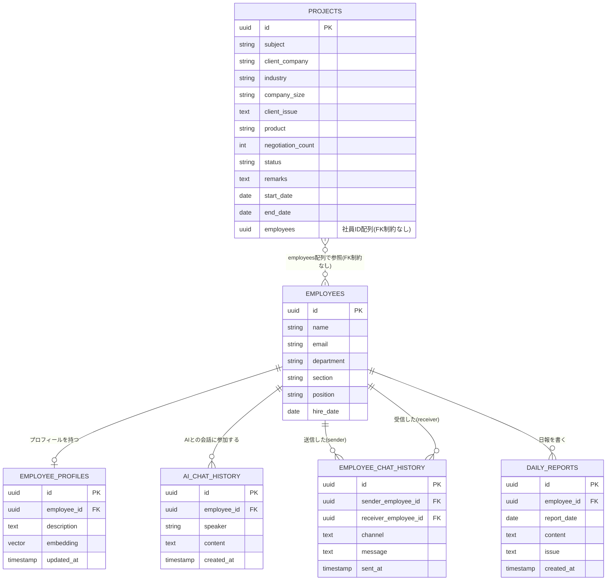

# DBスキーマ（ER図） — TEKIJIN

PR #18 の ER図（`docs/specs/人材サーチ_ER図.pdf`）を、差分レビュー可能な Markdown（Mermaid）に起こしたもの。
内容は ER 設計に忠実。他テーブルはすべて `EMPLOYEES` の「誰」を指す形でつながる。

> 整合メモ: 本 ER と実データ（PR #19）・技術仕様 §4 の間には差分がある
> （`name` 文字列 vs `employee_id` FK、`EMPLOYEE_PROFILES`/`embedding` の有無、`certifications`/`answers`/`recommendations`/`events` の未登場 等）。
> 統一方針は PR #18 / #19 のレビューコメントで追跡中。

## ER図

## 各テーブルの説明

### EMPLOYEES（社員基本情報）
社員1人につき1行。部・課の両方を記録できる。他のテーブルはすべてこのテーブルの「誰」を指し示す形でつながっている。

| カラム | 説明 |
|---|---|
| `id` | 社員を一意に識別するID |
| `name` / `email` | 氏名・メールアドレス |
| `department` / `section` | 部・課 |
| `position` | 役職 |
| `hire_date` | 入社日 |

### EMPLOYEE_PROFILES（社員プロフィール）
社員1人につき1行。スキル・特徴を自由記述の文章としてまとめて記録する。`embedding` 列を持たせることで、他の検索対象（過去QA、日報など）と同じ仕組みで意味検索にかけられる。

| カラム | 説明 |
|---|---|
| `employee_id` | 誰のプロフィールか（1人1行、UNIQUE） |
| `description` | スキル・得意分野・人柄などをまとめた自由記述文 |
| `embedding` | `description` をベクトル化したもの（AI検索用） |
| `updated_at` | 最終更新日時 |

### PROJECTS（案件）
案件そのものの情報。1案件につき1行。関わっている社員は別テーブルに分けず、`employees` 列に社員IDの配列として直接持たせる。

| カラム | 説明 |
|---|---|
| `subject` | 件名（案件のタイトル） |
| `client_company` | 顧客企業名 |
| `industry` | 顧客企業の業界 |
| `company_size` | 顧客企業の規模（例: 従業員数、売上規模など） |
| `client_issue` | 顧客が抱えていた課題 |
| `product` | 提案・提供した商材 |
| `negotiation_count` | 商談を行った回数 |
| `status` | 案件ステータス（例: 商談中／受注／失注／完了） |
| `remarks` | 備考（自由記述） |
| `start_date` / `end_date` | 案件の開始日・終了日 |
| `employees` | この案件に関わっている社員のIDを配列でまとめて格納（例: `[社員Aのid, 社員Bのid]`） |

### AI_CHAT_HISTORY（AIチャット履歴）
1行=1メッセージの会話ログ形式。`speaker` 列で発言者が社員かAIかを区別する。`employee_id` は常に EMPLOYEES への FK で、「どの社員との会話セッションか」を表す（AIが発言したメッセージの行でも、`employee_id` にはその会話相手の社員IDが入る）。

| カラム | 説明 |
|---|---|
| `employee_id` | どの社員の会話セッションか（FK、常に社員を指す） |
| `speaker` | 発言者の区分:「employee」か「ai」（FKではなく単純な区分値） |
| `content` | 発言内容（質問文、またはAIの回答文） |
| `created_at` | 発言日時 |

### EMPLOYEE_CHAT_HISTORY（社員間チャット履歴）
社員同士のチャット（SlackやTeams等から取り込んだ会話ログを想定）。「誰が誰に、何を話したか」を記録する。

| カラム | 説明 |
|---|---|
| `sender_employee_id` | 送信した社員 |
| `receiver_employee_id` | 受信した社員（グループチャットの場合は空でもよい） |
| `channel` | チャンネル名やグループ名（1対1の場合は空でよい） |
| `message` | メッセージ本文 |
| `sent_at` | 送信日時 |

### DAILY_REPORTS（日報）
社員が日々提出する日報。業務内容（`content`）と課題（`issue`）を分けて記録する。

| カラム | 説明 |
|---|---|
| `employee_id` | 日報を書いた社員 |
| `report_date` | 対象の業務日 |
| `content` | その日行った業務内容 |
| `issue` | その日感じた課題・困りごと |
| `created_at` | 日報が登録された日時 |
