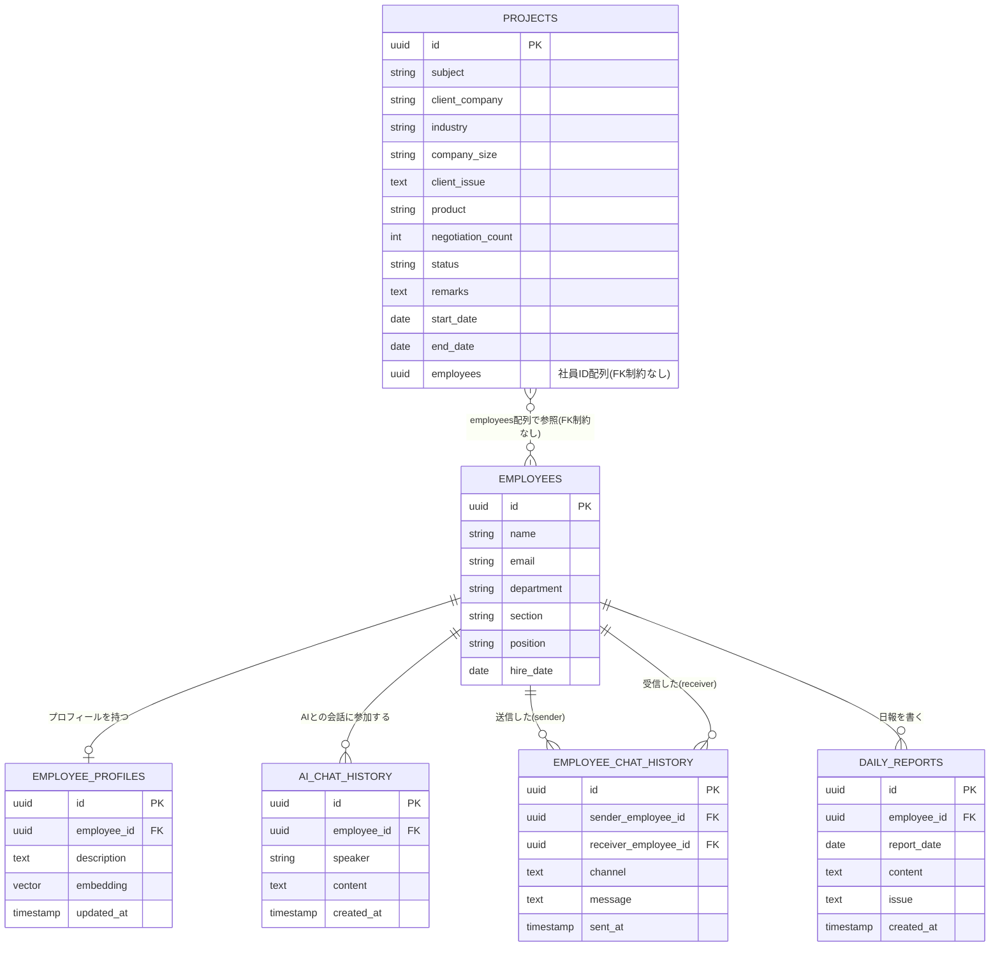
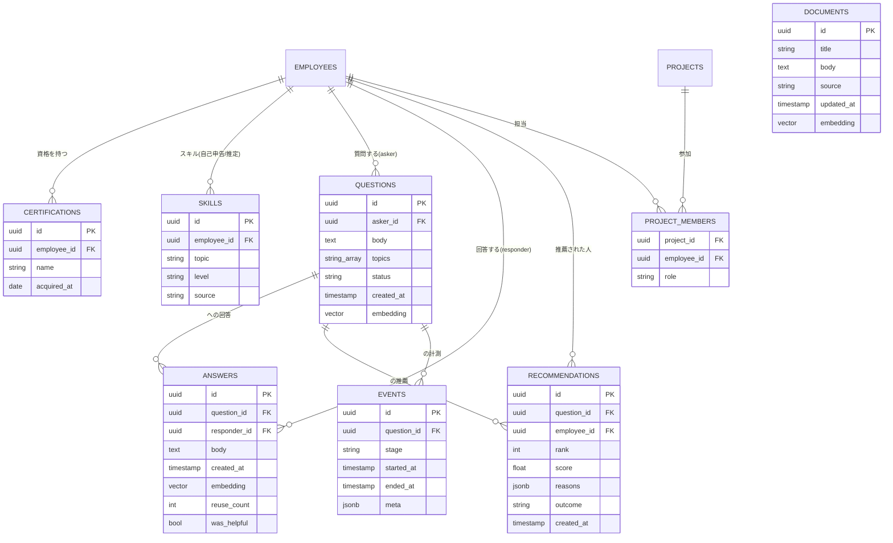
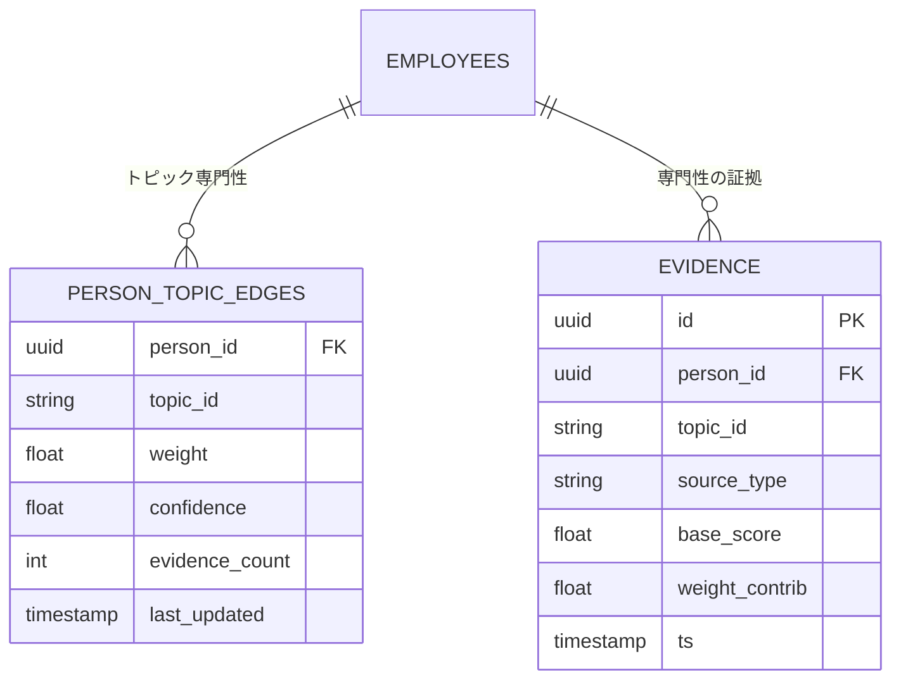

# DBスキーマ（ER図） — TEKIJIN

TEKIJIN のデータベース設計。**3層**で構成する。

- **A. 入力データ層** … 合成データ（PR #19）が埋める、社員・プロフィール・案件・チャット・日報。PR #18 の ER をベースとし、本ドキュメントを正とする。
- **B. アプリ実行時テーブル** … 質問・回答・推薦・計測など、アプリ稼働で溜まるデータ（技術仕様 §4 準拠）。
- **C. 専門性グラフ** … 行動痕跡から推定した「人×トピック」の重み付きエッジ（doc15＝新規性の中核）。

他テーブルはすべて `EMPLOYEES` の「誰」を FK で指す。永続化は PostgreSQL 16 + pgvector 1本（LangGraph の checkpoints は PostgresSaver が自動管理し、本図には含めない）。

> 整合状況（2026-08-21 監査）: A層は PR #18 の ER に忠実。**B層・C層は技術仕様 §4 / doc15 が要求するが ER 未登場**のため本ドキュメントで補完した。A層にも proximity 用の `branch`(拠点) 等が不足（末尾「A層の補足」参照）。実データ(PR #19)を A層スキーマへ寄せる方針は #18/#19 のレビューで追跡。
>
> 実装補足（#28）: PK 型は本 ER 図の `uuid` 表記ではなく**フィクスチャ実体に準拠**する。`employees`・`projects` は `int`、`cert_` / `q_` / `ans_` / `doc_` / `skill_` 接頭辞を持つエンティティ（certifications・questions・answers・documents・skills）は `string`。`project_members` の PK は `(project_id, employee_id)` とし、`role` は `CHECK(role IN ('lead','member'))` 付きの通常カラム（同一ペアで lead/member が二重登録されないため）。

## A. 入力データ層（合成データ層）— ER図

## A層 各テーブルの説明

### EMPLOYEES（社員基本情報）
社員1人につき1行。部・課の両方を記録できる。他のテーブルはすべてこのテーブルの「誰」を指し示す形でつながっている。

| カラム | 説明 |
|---|---|
| `id` | 社員を一意に識別するID |
| `name` / `email` | 氏名・メールアドレス |
| `department` / `section` | 部・課 |
| `position` | 役職 |
| `hire_date` | 入社日 |

### EMPLOYEE_PROFILES（社員プロフィール）
社員1人につき1行。スキル・特徴を自由記述の文章としてまとめて記録する。`embedding` 列を持たせることで、他の検索対象（過去QA、日報など）と同じ仕組みで意味検索にかけられる。

| カラム | 説明 |
|---|---|
| `employee_id` | 誰のプロフィールか（1人1行、UNIQUE） |
| `description` | スキル・得意分野・人柄などをまとめた自由記述文 |
| `embedding` | `description` をベクトル化したもの（AI検索用） |
| `updated_at` | 最終更新日時 |

### PROJECTS（案件）
案件そのものの情報。1案件につき1行。関わっている社員は別テーブルに分けず、`employees` 列に社員IDの配列として直接持たせる。

| カラム | 説明 |
|---|---|
| `subject` | 件名（案件のタイトル） |
| `client_company` | 顧客企業名 |
| `industry` | 顧客企業の業界 |
| `company_size` | 顧客企業の規模（例: 従業員数、売上規模など） |
| `client_issue` | 顧客が抱えていた課題 |
| `product` | 提案・提供した商材 |
| `negotiation_count` | 商談を行った回数 |
| `status` | 案件ステータス（例: 商談中／受注／失注／完了） |
| `remarks` | 備考（自由記述） |
| `start_date` / `end_date` | 案件の開始日・終了日 |
| `employees` | この案件に関わっている社員のIDを配列でまとめて格納（例: `[社員Aのid, 社員Bのid]`） |

### AI_CHAT_HISTORY（AIチャット履歴）
1行=1メッセージの会話ログ形式。`speaker` 列で発言者が社員かAIかを区別する。`employee_id` は常に EMPLOYEES への FK で、「どの社員との会話セッションか」を表す（AIが発言したメッセージの行でも、`employee_id` にはその会話相手の社員IDが入る）。

| カラム | 説明 |
|---|---|
| `employee_id` | どの社員の会話セッションか（FK、常に社員を指す） |
| `speaker` | 発言者の区分:「employee」か「ai」（FKではなく単純な区分値） |
| `content` | 発言内容（質問文、またはAIの回答文） |
| `created_at` | 発言日時 |

### EMPLOYEE_CHAT_HISTORY（社員間チャット履歴）
社員同士のチャット（SlackやTeams等から取り込んだ会話ログを想定）。「誰が誰に、何を話したか」を記録する。

| カラム | 説明 |
|---|---|
| `sender_employee_id` | 送信した社員 |
| `receiver_employee_id` | 受信した社員（グループチャットの場合は空でもよい） |
| `channel` | チャンネル名やグループ名（1対1の場合は空でよい） |
| `message` | メッセージ本文 |
| `sent_at` | 送信日時 |

### OFFLINE_CONSULTS（直接相談のふりかえり・#247）

「直接相談」（#245）は対面で行われるためチャットのような発言記録が残らず、F-10（回答を索引に
追加し専門性の推定を更新）が使える材料が無い。この表がその欠けた記録で、**質問者が書く**。

| カラム | 説明 |
|---|---|
| `question_id` | どの質問についての相談か（FK・NOT NULL・**質問ごとに1件（UNIQUE）**）。受諾される取次ぎは質問につき1件なので「その相談」は単数。重ねて書けると1回の実相談で上限（4件）を埋められる |
| `responder_id` | 相談に応じた人。**この行が専門性の証拠になる対象**。リクエスト本文で送るが信用しない——**その質問の取次ぎを受諾した本人**（`recommendations.outcome='accepted'`）と一致することを API が要求する |
| `asker_id` | 書いた人。認証済みプリンシパルから取り、リクエスト本文からは受け取らない |
| `topics[]` | `TOPIC_VOCABULARY` から選択（API 境界で検証）。スコアラーはこの文字列で join する |
| `asked` | 何を聞いたか（任意） |
| `answer_body` | 得られた回答・アドバイス（必須） |
| `resolution` | `resolved` / `partial` / `unresolved` |
| `created_at` | 記録日時（DB 既定 `now()`） |

**伝聞であることを重みに反映する**: 「質問者が、相談相手の発言を要約して書いたもの」なので、
自己申告（0.3）より低い **0.25**。件数で `topic_fit` を飽和させないよう、日報と同じく上限
（`OFFLINE_CONSULT_EVIDENCE_CAP` = 4）を設ける。

**「誰が書けるか」と「誰について書けるか」は別の制約**: 質問の所有者だけが書ける（前者）と
しても、質問は自分で作れるので、それだけでは任意の社員に上限いっぱいの証拠を付けられる。
後者を締めるのが `responder_id` = 受諾者の照合で、これが実際にスコアを守っている側。
受諾行が唯一の「この人に実際に相談した」という永続記録なので、権限の根拠としても正しい。

**書く時点で読める情報源が要る**: `GET /handoff` は保留中の取次ぎビューで、対応者が結末を
記録した瞬間に 404 する——対面で相談できるようになる、まさにその瞬間に消える。ふりかえり
画面は `GET /consult-retrospective/{session_id}`（`questions` + `recommendations` +
`offline_consults` を直接読む）を使う。

---

### DAILY_REPORTS（日報）
社員が日々提出する日報。業務内容（`content`）と課題（`issue`）を分けて記録する。

| カラム | 説明 |
|---|---|
| `employee_id` | 日報を書いた社員 |
| `report_date` | 対象の業務日 |
| `content` | その日行った業務内容 |
| `issue` | その日感じた課題・困りごと |
| `created_at` | 日報が登録された日時 |

---

## B. アプリ実行時テーブル（技術仕様 §4 準拠）

アプリ稼働で溜まるデータ。質問→推薦→回答→計測のループを支える。合成データではなく、デモ実行中に生成される（一部は評価用に合成でシードする）。

| テーブル | 役割 | 主なカラム |
|---|---|---|
| `CERTIFICATIONS` | 資格（**最も確実な証拠**、base_score 0.6） | `employee_id` FK, `name`, `acquired_at` |
| `SKILLS` | 自己申告/推定スキル（base_score 0.3） | `employee_id` FK, `topic`, `level`, `source` |
| `QUESTIONS` | 聞く側の質問 | `asker_id` FK, `body`, `topics[]`, `status`, `embedding` |
| `ANSWERS` | 回答（**F-10 ナレッジ化・学習の燃料**） | `question_id` FK, `responder_id` FK, `body`, `embedding`, `reuse_count`, `was_helpful` |
| `RECOMMENDATIONS` | 推薦結果と結末（**学習の要**） | `question_id` FK, `employee_id` FK, `rank`, `score`, `reasons`(jsonb), `outcome`(accepted/declined/timeout), `created_at`(推薦時刻・DB既定 now) |
| `EVENTS` | 各ステージの計測（**p50/p95 レイテンシKPI**） | `question_id` FK, `stage`, `started_at`, `ended_at`, `meta` |
| `PROJECT_MEMBERS` | 案件の担当（**lead/member を区別**。base_score が lead 0.8 / member 0.5） | `project_id` FK, `employee_id` FK, `role`(lead/member) |
| `DOCUMENTS` | 社内文書（格下げ経路用・優先度低） | `title`, `body`, `source`, `embedding` |
| `OFFLINE_CONSULTS` | **直接相談のふりかえり**（#247。対面相談は記録が残らないため、質問者が書き起こす。伝聞なので base_score 0.25 = 自己申告 0.3 未満） | `question_id` FK, `responder_id` FK, `asker_id` FK, `topics[]`, `asked`, `answer_body`, `resolution`(resolved/partial/unresolved), `created_at` |

> `ANSWERS.reuse_count`/`was_helpful` は `answer_quality` スコアと C8 グラフ更新に、`RECOMMENDATIONS.outcome` は `load`（負荷）減点と「使うほど育つ」学習に、`EVENTS` はレイテンシ計測に直結する（技術仕様 §5・§7）。`RECOMMENDATIONS.created_at`（DB 既定 `now()`）は `load` を**直近7日**の推薦数で数えるための時刻窓に使う（技術仕様 §5）。実装では `ANSWERS.created_at` も同様に DB 既定 `now()` を持ち、実行時に生成される回答へ確実に時刻が入る。

---

## C. 専門性グラフ（doc15＝新規性の中核）

「誰が何に詳しいか」を、行動痕跡（回答・案件・資格）から**決定的に積み上げて**表す「人 × トピック」の重み付きエッジ。C8 ノードがオンライン更新する。**エッジは `EVIDENCE` から再計算可能**（監査可能＝根拠表示に使う）。

| テーブル | 役割 | 主なカラム |
|---|---|---|
| `PERSON_TOPIC_EDGES` | 人×トピックの専門性エッジ | `person_id` FK, `topic_id`, `weight`, `confidence`, `evidence_count`, `last_updated` |
| `EVIDENCE` | エッジの根拠（積み上げ） | `person_id` FK, `topic_id`, `source_type`(cert/project/answer/self/redirect), `base_score`, `weight_contrib`, `ts` |

> `base_score`: 有用回答 1.0 > 案件リード 0.8 > 過去回答 0.7 > 資格 0.6 > 案件メンバー 0.5 > 自己申告 0.3（doc15）> **直接相談のふりかえり 0.25**（#247・伝聞）> 日報 0.15（#355）。断り(declined)は専門性を下げず余裕度のみ下げる。
>
> **同じ規則をふりかえりにも適用する**: `resolution=unresolved`（解決しなかった）は記録は残るが
> 専門性の証拠にならず、**下げもしない**。一度うまくいかなかったことが、その人が実際に知っている
> トピックでの評価を損なってはいけない。

---

## A層の補足（仕様整合のための追加が必要な列）

PR #18 の ER（A層）に、仕様上あと少し不足がある。実データ(PR #19)を寄せる際に合わせて補う。

| 対象 | 追加/変更 | 理由 |
|---|---|---|
| `EMPLOYEES` | `branch`(拠点) を追加 | `proximity`（同支店>同エリア>全社）の計算に必要（技術仕様 §5 `w4·proximity`） |
| `EMPLOYEES` | `role` を追加（`position` と別に職種） | 職種比率・スコアの説明に使用 |
| `PROJECTS` | `employees uuid[]` は **`PROJECT_MEMBERS`（役割つき）を正**とする | 配列では lead/member を区別できず base_score(0.8/0.5)を割り当てられない |
| （算出でよい） | `years`(在籍年数) は `hire_date` から算出 | 冗長カラムにしない |
