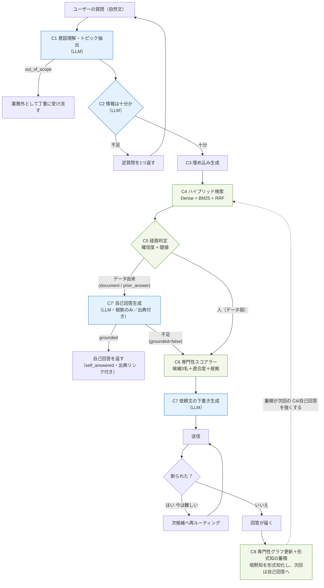
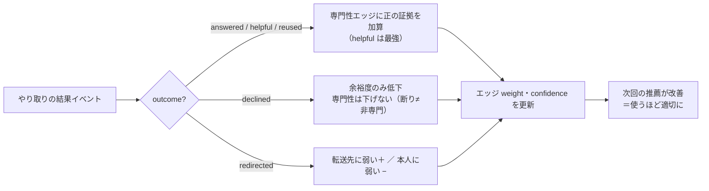
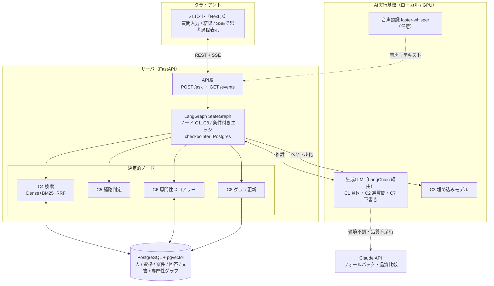
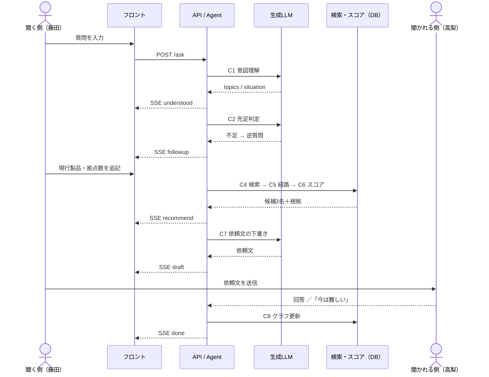

# モデル定義 — TEKIJIN

version 0.2 / 2026-08-25（#292 で方針転換を反映）
対象プロダクト: TEKIJIN。**暗黙知を蓄積し、形式知へ変換し続ける AIチャットボット基盤**。

メイン機能は次の**三系統**（2026-08-25 の方針転換・#291）:

1. **自己回答（データ由来）** — 既存の社内データ・過去の回答にあるものは、AI が **出典（ソースのリンク）付きで
   直接回答**する。人に取り次がない。
2. **取次ぎ（暗黙知・データなし）** — データが無い/暗黙的なものは、**適切な社員に取り次ぐ**（従来の人物推薦）。
3. **蓄積（形式知化）** — ②で見つかった暗黙知を、**チャット内容から形式知へ変換して蓄積**し、次回以降は①で
   答えられるようにする。「使うほど貯まる」ループの実体。

> **旧方針からの変更**: v0.1 の「**答えの出所は必ず人**」は**廃止**した。取次ぎは"解決手段の一つ"であって
> 唯一ではない。データで答えられるものは自己回答し、取次ぎは蓄積（主軸）を回すための入口に位置づけ直す。

これに伴い **C5 は「自己回答（データ十分）vs 取次ぎ（人）」の判定に再定義**、**回答生成 C7'（self-answer）を追加**、
**C8 を「形式知の蓄積」に拡張**する。実装は #291 で段階的に（part1 コンポーネント／part2 グラフ配線まで完了、
**既定OFF** `self_answer_enabled=False`。有効化は part3 の **recall 中心**検証（#297）の後）。回答時は**根拠の
ソースリンクをチャット内に含める**。

> **用語**: 「**主線**」は経路判定（C5）の既定ルート＝人への取次ぎ（補助＝過去回答提示 / 格下げ＝文書）を指す
> "どの経路で解くか"の語。「**主軸**」はプロダクト目的＝ナレッジ蓄積（C8）を指す"何のためのアプリか"の語。
> 別レイヤであり、主線（取次ぎ）は主軸（蓄積）を回す手段。

> **設計の芯**: ランキング・推薦は**決定的スコア**で行い、LLM は「理解・判定・生成」に限定する。
> 理由は再現性・説明可能性・速度・評価可能性（13_技術仕様書 §1）。

---

## 0. AIコンポーネント一覧

システムは「1つの大きなAIモデル」ではなく、**役割の異なる小さなモデル/関数の合成**。
これらを **LangGraph の `StateGraph` のノード**として繋ぐ（C1〜C8＝ノード、分岐＝条件付きエッジ）。
LLM への接続は **LangChain**（`init_chat_model` / `with_structured_output`）で統一する。

| ID | コンポーネント | 種別 | LangGraph上の実装 | 入力→出力の要点 |
| --- | --- | --- | --- | --- |
| C1 | 意図理解・トピック抽出 | LLM（構造化出力） | ノード（LLM + `with_structured_output`）→ 条件付きエッジ(out_of_scope) | 質問 → トピック・製品・状況 |
| C2 | 情報充足判定・逆質問生成 | LLM（構造化出力） | ノード + **`interrupt()`**（不足なら聞き返し） | 質問＋文脈 → 不足項目 or 逆質問 |
| C3 | 埋め込み生成 | 埋め込みモデル | C4ノード内で実行 | テキスト → ベクトル |
| C4 | ハイブリッド検索 | 決定的（Dense+BM25+RRF） | ノード（決定的） | クエリ → 近い過去QA/文書/人 |
| C5 | 解決経路の判定（**自己回答 vs 取次ぎ**） | 決定的（確信度＋閾値） | **`add_conditional_edges`**（person/prior_answer/document）。データ由来経路(document/prior_answer)は C7' 自己回答へ、person は取次ぎへ | 検索結果 → 経路選択 |
| C6 | 専門性スコアラー | 決定的（証拠積み上げ） | ノード（決定的） | トピック＋人 → 適合度・根拠・順位 |
| C7 | 依頼文の下書き生成 | LLM | ノード（LLM） | 質問＋相手＋必須項目 → 依頼文 |
| C7' | 自己回答生成（#291・**配線済み/既定OFF**） | LLM（構造化出力） | ノード（LLM、`self_answer_enabled` で gate）。データ由来経路(document/prior_answer)で C5 の後に発火し、grounded なら `self_answered` 終端、不足なら元経路へフォールバック | 質問＋検索根拠（過去QA/文書, 出典ID付き） → 出典付き回答 or 「答えられない」 |
| C8 | 専門性グラフ更新＋**形式知の蓄積** | 決定的（オンライン更新） | ノード（決定的） | 結果イベント → エッジ重み更新／取次ぎで得た回答を形式知として蓄積 |

LLM を使うのは **C1・C2・C7（＋#291 で C7'）**。推薦の中核（C4・C5・C6・C8）は決定的ノード。
C7'（self-answer）は**提供された根拠だけ**から回答し、使った出典を `cited_source_ids` に列挙、根拠が
不十分なら `grounded=false` で人への取次ぎにフォールバックする（ハルシネーション禁止・#291）。
**LangGraph はノードの接続・分岐・ストリーミング・中断再開・永続化を担い、"並べ替え"はしない。**

---

## 1. 全体データフロー



> 青 = 生成LLM（C1・C2・C7・C7'）、緑 = 決定的処理（C4〜C8）。**推薦の中核は決定的**。
> データ由来経路は **C7' 自己回答**を試し、grounded なら出典付きで直接回答、不足なら取次ぎへフォールバック。
> C8 の蓄積が次回の検索・自己回答を強くする（点線ループ＝主軸）。
> このフローチャート＝ **LangGraph の StateGraph** そのもの（角丸＝ノード、菱形＝条件付きエッジ）。
> 各ノード更新は `graph.stream(stream_mode="updates")` で取り出し SSE 配信（＝思考過程の可視化）。

### LangGraph としての実装対応

| フロー上の要素 | LangGraph の機能 |
| --- | --- |
| C1〜C8 の各処理 | `add_node`（ノード。LLMノードと決定的ノードが混在） |
| out_of_scope / 充足 / 経路 / 断り再ルーティング | `add_conditional_edges`（分岐を宣言的に） |
| C2 の逆質問（ユーザーへ聞き返す） | `interrupt()` → ユーザー回答で `Command(resume=...)` |
| 思考過程の可視化 | `graph.stream(stream_mode="updates")` → SSE |
| セッション・中断再開・メモリ | `compile(checkpointer=PostgresSaver)`、`thread_id`=セッション |
| 状態 | `State`（`TypedDict`）。各ノードは部分更新の dict を返す |

---

## 2. コンポーネント別 入出力定義

### C1. 意図理解・トピック抽出（LLM / 構造化出力）

- **目的**: 自由文の質問を、検索・スコアリングで使える構造に落とす。業務外・悪意入力もここで分類。
- **モデル**: ローカルLLM（小〜中型で可。JSON固定なので軽い）。開発時は Claude で品質基準を作る。
- **入力**:

```json
{ "question": "お客様がUTMの入れ替えを検討中。他社製品からの移行で注意点は?",
  "asker": { "dept": "第3営業部", "role": "営業", "years": 1 } }
```

- **出力（JSON Schema 準拠を強制）**:

```json
{ "topics": ["セキュリティ", "UTM", "移行"],
  "products": ["UTM"],
  "situation": "他社製品からの移行",
  "question_type": "技術相談",            // 製品QA/見積/技術相談/事務手続き/雑談/業務外
  "out_of_scope": false,
  "confidence": 0.86 }
```

- **失敗時**: `out_of_scope=true` または `confidence<閾値` → 回答を作らず、業務外は丁重に受け流す / 低確信は C2 の逆質問へ。

### C2. 情報充足判定・逆質問生成（LLM / 構造化出力）

- **目的**: 取り次ぐ/検索する前に、判断に必要な情報が揃っているか点検し、足りなければ1問だけ聞き返す。
  （Notionヒアリング: チャットボットは一問一答で仮説が出ない → **先に不足を埋める**のが差別化）
- **入力**: C1出力 + 既往の会話文脈。
- **出力**:

```json
{ "sufficient": false,
  "missing": ["現行製品", "対象拠点数"],
  "followup_question": "現行の製品と、対象の拠点数を教えてください" }
```

- **ルール**: 逆質問は**まとめて1回**（往復を増やさない）。`sufficient=true` になるまで先へ進めない。

### C3. 埋め込み生成（埋め込みモデル）

- **目的**: 質問・過去QA・案件・文書・人の自己紹介をベクトル化し、意味検索を可能にする。
- **採用モデル**: `nvidia/Nemotron-3-Embed-1B-BF16`（2048次元）。**実測で選定済み**（#61 /
  ADR-0002：層2 R@3 = 0.615 で5本中1位）。退避先は Apache-2.0 の `Qwen3-Embedding-0.6B`。ローカル実行。
- **入力**: テキスト（クエリ/パッセージ）。**出力**: 固定次元ベクトル。
- **注意**: モデルによって `query:` / `passage:` プレフィックス要否が異なる。索引時と検索時で一致させる。

### C4. ハイブリッド検索（決定的：Dense + BM25 + RRF）

- **目的**: クエリに近い「過去QA」「社内文書」「人」を高速に絞り込む。
- **構成**: Dense(pgvector) と Sparse(BM25 + SudachiPy) を **重み付き RRF(k=60)** で統合
  （`score(d)=Σ_r w_r/(k+rank_r(d))`）。型番・社内用語（例「たよれーる」「SPR」）は BM25 が拾う。
- **重み**: dense チャネル=1.0、**BM25=`bm25_weight`（既定 0.2、#68）**。等重み RRF は評価セット v2
  （症状語クエリ）で BM25 の弱い順位を dense と同格に扱い層2 R@3 が -0.128 だったため下げた。
  BM25 は消さない（型番・製品名で効く）。dense 信号強度に応じた適応重みは #114。
- **入力**: query vector + 生クエリ（BM25用トークン）。
- **出力**:

```json
{ "past_answers": [{ "qa_id": "...", "score": 0.62, "responder_id": "E017" }],
  "documents":   [{ "doc_id": "...", "score": 0.31 }],
  "candidate_people": ["E017", "E042", "E103"] }
```

### C5. 解決経路の判定（決定的：確信度 × 閾値）＝「自己回答 vs 取次ぎ」

- **目的**: 「**データで答えられるか（自己回答）**」「**人に取り次ぐか**」を、C4 の確信度で振り分ける。
  データが強い（過去回答・文書に該当）→ **自己回答候補**、弱い → **取次ぎ（人）**。
  旧方針の「既定は常に人」は廃止（#291）。
- **入力**: C4の各スコア。**出力**:

```json
{ "route": "document",         // person(取次ぎ) / prior_answer・document(データ由来=自己回答候補)
  "reason": "社内文書に該当あり",
  "confidence": 0.80 }
```

- **ルール**:
  - `route` の値自体は決定的（確信度×閾値）。**データ由来経路（`document` / `prior_answer`）は C7' 自己回答へ**、
    `person` は C6→取次ぎへ進む。
  - 自己回答が**根拠不十分（`grounded=false`）なら元の経路にフォールバック**（document は文書終端＋人物フォールバック、
    prior_answer は pinned 取次ぎ）。＝「データで答えられなければ人へ」を保証。
  - 経路の閾値は評価セットで決める（recall 中心・#297）。`self_answer_enabled=false` の間は C7' を挟まず旧挙動。

### C6. 専門性スコアラー（決定的：証拠積み上げ）

- **目的**: 「誰が詳しいか」を、行動痕跡（回答・案件・資格）から**推定して順位付け**し、根拠を出す。
  詳細な式・エッジ・成長は 15_専門性推定とグラフ成長。
- **入力**: 質問トピック + 候補者。**出力**:

```json
{ "recommendations": [
    { "person_id": "E017", "name": "高梨 健太", "dept": "技術部",
      "score": 0.82, "confidence": "高",
      "reasons": [
        { "type": "cert",    "detail": "情報処理安全確保支援士" },
        { "type": "answers", "detail": "類似の質問に過去5件回答" },
        { "type": "project", "detail": "直近3か月に同種案件を2件担当" },
        { "type": "load",    "detail": "今週の対応件数: 少なめ" } ] } ] }
```

- **式（要点）**: `score = w1·topic_fit + w2·recency + w3·answer_quality + w4·proximity − w5·load`。
  各項の寄与をそのまま UI の「選ばれた理由」に出す（説明可能性＝誤推薦対策）。

### C7. 依頼文の下書き生成（LLM）

- **目的**: 相手の職種・関係性に合わせ、**必須項目が埋まった**依頼文を作る。
  （Notionヒアリング: 承認は階層的、呼称ルールが難しい → 失礼のない文面の負担を消す。
  受け手の「3往復してやっと本題」を無くす＝聞かれる側のための機能）
- **入力**:

```json
{ "asker": {...}, "responder": { "name":"高梨", "dept":"技術部" },
  "question": "...", "required_fields": ["現行製品","拠点数","希望時期"],
  "known_values": { "現行製品":"A社UTM","拠点数":"3拠点","希望時期":"10月" } }
```

- **出力**: 依頼文テキスト（ユーザーが編集可能）。**制約**: 事実を創作しない・敬体・簡潔。

### C7'. 自己回答生成（LLM / 構造化出力）＝データ由来の出典付き回答（#291）

- **目的**: 過去QA・社内文書に**答えが既にある**ものを、**その根拠だけ**から出典付きで回答する。人に取り次がない。
- **配線**: `self_answer_enabled`（既定 false）で gate。データ由来経路（document / prior_answer）で C5 の後に発火。
- **入力**: 質問＋C4 上位ヒットを**出典ID付き**で再構成した根拠（`collect_cited_evidence`。過去QA=`qa`／文書=`document`、
  各 `source_id` 付き）。`<evidence>` タグで囲み、質問ともども `_fence_safe` で無害化（注入対策・#282と同型）。
- **出力（JSON Schema 準拠を強制）**:

```json
{ "grounded": true,
  "answer": "社内の運用手順では、保守時間内に更新します。",
  "cited_source_ids": ["doc_001", "qa_0123"] }   // 使った根拠の source_id（提供分の部分集合）
```

- **不可欠な不変条件**（ハルシネーション禁止）:
  - 根拠が空 → LLM を呼ばず `grounded=false`（→ 取次ぎへフォールバック）。
  - `grounded=true` は **answer 非空 かつ 実在する出典を最低1つ**（供給された根拠に無い出典は落とし、全て捏造なら
    `grounded=false` に格下げ）。＝「無出典の断定」を絶対に出さない。
- **終端**: grounded → `self_answered`（SSE `message`。`citations`=`[{source_id, kind}]` を伴い、**チャットに出典リンク**を出す）。
  自己回答は**自己解決**として計上（`resolution_kind="self"`・経路に依らず）。

### C8. 専門性グラフ更新＋形式知の蓄積（決定的：オンライン更新）

- **目的**: 1回のやり取りの結果を形式知として取り込み、エッジ重みを増分更新して
  **使うほど精度を上げ、ナレッジを蓄積する**。これが本システムの主軸機構（暗黙知→形式知の変換点）。
  **取次ぎ（②）で得た回答＝それまでデータに無かった暗黙知**を形式知として書き戻し、次回は C7' 自己回答（①）で
  答えられるようにする（蓄積→自己回答のループ）。
- **入力（イベント）**:

```json
{ "topic": "UTM", "responder_id": "E017",
  "outcome": "answered_helpful",   // answered / answered_helpful / declined / redirected / reused
  "redirect_to": null }
```

- **作用（要点。詳細は 15_専門性推定とグラフ成長）**:



- **出力**: 更新後の `person_topic_edges`（weight, confidence, evidence_count）。

---

## 3. モデル一覧（アーキテクチャ）

### システム構成図



> **顧客・社員に関わる推論はローカルで完結**（顧客情報を社外AIに出さない）。Claude はフォールバック限定。

### モデル一覧

| 用途 | 種別 | 採用（候補） | 実行場所 | 代替 |
| --- | --- | --- | --- | --- |
| **オーケストレーション** | フレームワーク | **LangGraph（StateGraph）** | サーバ | — |
| **LLM 接続 / 構造化出力** | フレームワーク | **LangChain**（`init_chat_model` / `with_structured_output`） | サーバ | — |
| **状態永続化 / メモリ** | チェックポイント | **langgraph-checkpoint-postgres（PostgresSaver）** | サーバ（既存DB） | InMemorySaver（開発初期） |
| 意図理解 / 逆質問 / 下書き（C1,C2,C7） | 生成LLM | ローカルLLM 20〜30B級（DGX Sparkに載る最大） | ローカル（GPU） | Claude API（品質不足・環境不調時のフォールバック） |
| 埋め込み（C3） | 埋め込み | **Nemotron-3-Embed-1B**（2048次元, #61/ADR-0002。退避先 Qwen3-Embedding-0.6B） | ローカル（GPU/CPU） | — |
| 検索（C4） | 決定的 | pgvector(HNSW) + BM25(SudachiPy) + RRF | サーバ | pgroonga/OpenSearch（規模拡大時） |
| 経路判定（C5） | 決定的 | 確信度×閾値ルール | サーバ | — |
| スコアラー（C6） | 決定的 | 証拠積み上げ式 | サーバ | — |
| グラフ更新（C8） | 決定的 | オンライン増分更新 | サーバ | — |
| 音声入力（任意） | 音声認識 | faster-whisper | ローカル | — |

サービング: DAY3〜5 は **Ollama**（起動最短）、DAY6〜7 で余力があれば **vLLM** に載せ替え、
前後のレイテンシ比較を「推論高速化」の実測として示す（13_技術仕様書 §3.6）。

### ローカル / クラウド境界（プライバシー）

- 顧客・社員に関わる推論（C1〜C8 の中核）は**ローカルで完結**させる方針。
  「顧客情報を社外の生成AIに出さない」という実用性の物語（00_勝ち筋サマリ）。
- Claude API はフォールバック / 開発時 / 品質比較に限定。合成データで検証する。

---

## 4. 外部API（システム全体の入出力契約）

### 1件の質問が流れるシーケンス



> 上図は**取次ぎ（人）**のシーケンス。**データ由来**の質問は C5 の後に **C7' 自己回答**が発火し、
> `understood → route → message(self_answered, citations)` で完結する（recommend/draft/send を挟まない）。
> 根拠不十分なら上図の取次ぎにフォールバックする。

### リクエスト `POST /ask`

```json
{ "asker_id": "E200", "question": "…", "session_id": "…" }
```

### SSE イベント `GET /events/{session_id}`（思考過程）

**LangGraph の `graph.stream(stream_mode="updates")` が返す「ノード名→更新」を、そのまま SSE に写像**する。
逆質問は `interrupt()`、ユーザーの回答で `Command(resume=...)` により再開する。

```
（LangGraphノード更新）              →（SSEイベント）
c1_understand: {topics, situation}   → event: understood
c2_sufficiency: interrupt(逆質問)     → event: followup   （回答で resume）
c5_route: {route, confidence}         → event: route
c6_score: {recommendations}           → event: recommend
c7_draft: {draft}                     → event: draft
c8_update: {status}                   → event: done
self_answered: {answer, citations}    → event: message   （自己回答の終端・出典リンク付き）
off_topic / document /               → event: message   （非人ルートの終端）
  unresolved_intent / no_candidate / no_expert
（接続断・例外）                       → event: error
```

```
event: understood   data: {"topics":[...],"situation":"…"}
event: followup      data: {"question":"現行製品と拠点数を教えてください"}
event: route         data: {"route":"person","reason":"…","confidence":0.78}
event: recommend     data: {"recommendations":[ … C6出力 … ]}
event: draft         data: {"draft":"高梨さん …"}
event: done          data: {"status":"sent","answer":"…"}
event: message       data: {"status":"document","message":"…","doc_id":"doc_001","citations":[]}
event: message       data: {"status":"self_answered","message":"…","citations":[{"source_id":"doc_001","kind":"document"}]}
event: error         data: {"error":"内部エラーが発生しました"}
```

**終端 `message` イベント**（`event: message`）は、人に取り次がない終端の結果を表す。
`status` は終端ノードに対応する:

| status | 発生元ノード | 意味 |
|---|---|---|
| `self_answered` | self_answered | **データ由来の自己回答（#291）**。`citations`=`[{source_id, kind}]` に使った出典（`kind`=`qa`/`document`）。チャットは各出典へのリンクを描画 |
| `off_topic` | off_topic | 業務外・悪意ある入力（C1 が `out_of_scope`。個人情報要求/注入含む、#118） |
| `document` | document | 社内文書ルートで自己解決。`doc_id` に該当文書ID（#143。`GET /documents/{doc_id}` で本文取得） |
| `unresolved` | unresolved_intent | 逆質問後もトピックを特定できず |
| `no_candidate` | no_candidate | 適任者が見つからない |
| `no_expert` | no_expert | 証拠十分性クリティック(#70)が「社内に痕跡なし」と判定（`answerability_enabled` 時のみ） |

`doc_id` は `document` のときのみ非 null。`citations` は `self_answered` のときのみ非空（他は `[]`）。
`done` は `answer`（取り次ぎ確定メッセージ）を伴う。
接続断・例外時は `event: error`（汎用文言のみ・詳細は非開示）。

### レスポンス（最終）

```json
{ "route": "person",
  "recommendations": [ … ],
  "draft": "…",
  "meta": { "latency_ms": {"p50_target":1500,"p95_target":3000} } }
```

想定外入力時: `{"route":"declined","message":"業務外のため回答できません"}`（誤回答対策）。

---

## 5. プロンプト設計方針（C1・C2・C7・C7'）

| 項目 | 方針 |
| --- | --- |
| 出力形式 | **LangChain `model.with_structured_output(PydanticSchema)` で強制**。自由文で返させない（C1・C2・C7'）。スキーマは `backend/src/tekijin/llm/schemas.py` に集約 |
| ハルシネーション抑制 | 「わからない場合は out_of_scope / sufficient=false を返す」を明示。**創作させない**。C7' 自己回答は**提供根拠のみ**から回答し、根拠が無ければ `grounded=false`（無出典の断定を出さない・#291） |
| 参考データの無害化 | C7'（`<evidence>`）・#70 critic（`<candidates>`）は外部データをタグで囲み `_fence_safe` で命令注入を封じる（#282） |
| few-shot | 大塚商会の実商材（複合機/UTM/たのめーる/たよれーる/SPR）を例に数件 |
| 言語 | 日本語。敬体。社内用語を保持（SudachiPy mode C と整合） |
| バージョン管理 | プロンプトは `backend/agent/prompts/` でファイル管理し、変更を追える（発表素材にも） |
| 温度 | C1・C2 は低温（決定性重視）、C7 は中温（自然さ） |

---

## 6. 評価との対応（16_完成度評価 と接続）

**評価は recall 中心で見る**（メンター方針・#297）。precision 系は補助。

| コンポーネント | 測る指標（recall 中心） | 評価項目 |
| --- | --- | --- |
| C1 意図理解 | トピック抽出の一致率（recall） | 精度・実用性 |
| C5 判定 | **「自己回答すべき vs 取り次ぐべき」の振り分け recall**（取りこぼしを見る） | 自律性・工夫 |
| C7' 自己回答 | **source recall**（回答の根拠となるべき文書/過去QA を検索・引用で落とさない率）＋出典正しさ | 精度・実用性（#291/#297） |
| C6 スコアラー | **Recall@3**（主指標）／ Top-1精度 / MRR（補助） | 精度・実用性 |
| C8 蓄積 | 利用0→N件での Recall@3 改善曲線／暗黙知の形式知化率 | 自律性・工夫（使うほど適切に） |
| 全体 | レイテンシ p50/p95、想定外入力の降参率 | 技術完成度 / インタラクション設計 |

評価データは #296（`gold_source` 付き・自己回答/取次ぎのラベル・L4 ラベル矛盾の是正・型番クエリ集合）、
評価実装は #297。評価セットは社員ヒアリングの実質問（09_ヒアリング設計_人材サーチ §4）を核とする。

---

## 7. まだ決めていない事項（仕様確定時に埋める）

- ローカルLLMの具体モデル（DGX Spark 実機スペック確認後）
- 埋め込みモデルの最終選定（DAY3 実測）
- スコア式の重み `w1..w5`（評価セットで調整）
- 経路判定・確信度の閾値（評価セットで決定・recall 中心）
- **自己回答 C7' の有効化**（`self_answer_enabled`）：part3 の recall 中心検証（#296→#297）で
  「自己回答すべき/取り次ぐべき」の取りこぼしと出典正しさを測ってから ON
- **証拠十分性クリティック #70 の有効化**（`answerability_enabled`）：DGX の閾値スイープ後（現状 net+6 だが recall 毀損あり）
- トピックのタクソノミ語彙（大塚商会の商材体系から種を作る。15_専門性推定とグラフ成長 §1）
- LangGraph / LangChain の**固定バージョン**（着手時に context7 等で当該版のAPIを確認して pin）
- checkpointer を最初から Postgres にするか、InMemorySaver で始めて後で差し替えるか（工数次第）

> 本書は「AIとしての設計図」。実装は仕様確定後、リポジトリ（TEKIJIN）の
> `docs/specs/` に確定版を置いてから着手する。
